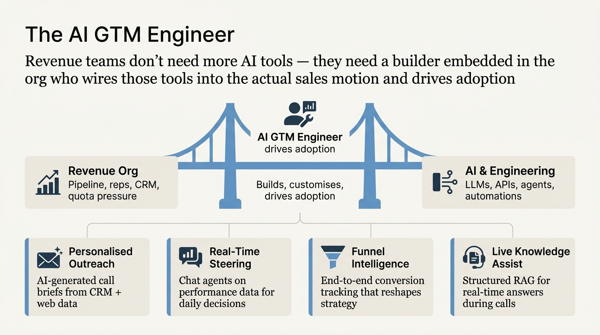
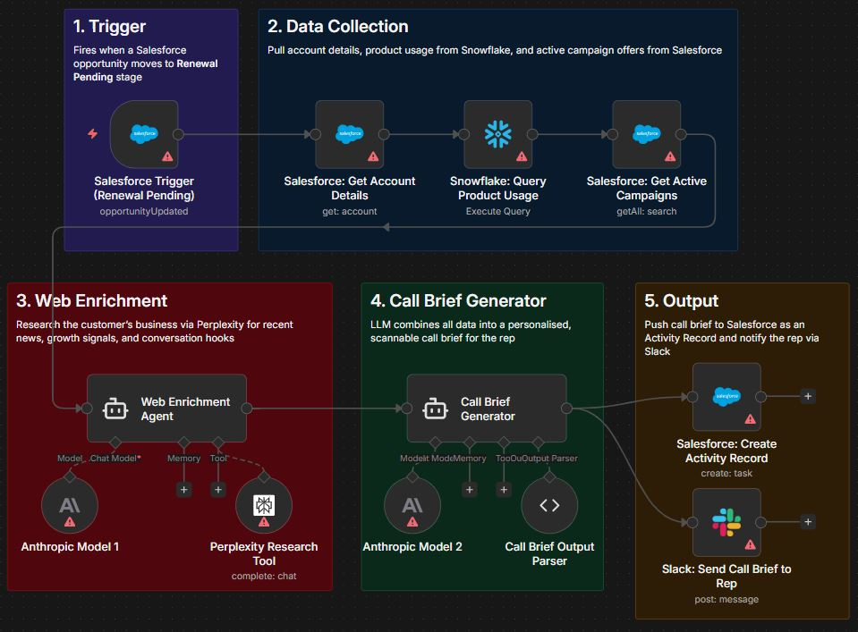
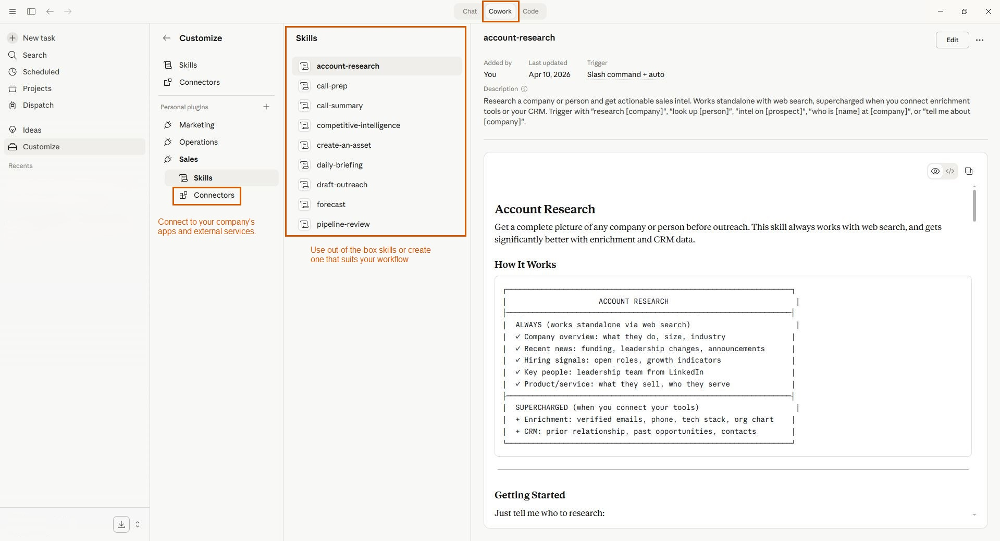

---
authors:
  - rv
categories:
  - AI Adoption
  - Applied AI
comments: true
date: 2026-04-12
description: Revenue teams have the AI tools. What they need now is someone who can
  build them into the sales motion and drive adoption from inside the org.
draft: false
slug: ai-gtm-engineer-revenue-teams-need-builders
tags:
  - ai gtm engineer
  - revenue operations
  - ai adoption
  - sales ai
  - n8n
  - claude
  - ai agents
---

# The AI GTM Engineer: Why Revenue Teams Need Builders, Not Just Tools

**TL;DR:** Revenue teams have more AI tools than ever. The opportunity now isn't buying more; it's wiring them into the actual sales motion. The AI GTM Engineer is a new kind of role that sits inside the revenue org, builds custom AI systems for reps and managers, and drives adoption until the tools stick. Here's what that looks like in practice, with four real examples.

<!-- more -->

The AI tools are there. Revenue teams have access to more intelligent software than at any point in history. And yet, for most sales orgs, the gap between what these tools *can* do and what reps *actually* use day-to-day remains wide open.

That gap is an opportunity. Not for another tool purchase, but for a new kind of role.

## What Is an AI GTM Engineer?

An AI GTM Engineer sits at the intersection of revenue operations, sales, and engineering. They're embedded in the revenue org. They understand pipeline, conversion rates, and rep workflows. And they can build AI systems that actually move those numbers.

This isn't a product engineer who occasionally talks to sales. It's someone who has sat through pipeline reviews, watched reps prep for calls, and understands the real friction points in a sales motion, not just the ones that show up in a requirements doc.

Traditional rev ops optimises processes and configures existing tools. An AI GTM Engineer builds entirely new capabilities: agents, automations, and intelligent workflows that didn't exist before.

They speak both languages. That's what makes the role work.

## Why the Gap Exists

Most AI tools fail to land in sales teams for a structural reason. They're built by engineers who have never navigated a CRM under pressure, or they're bought by revenue leaders who don't have visibility into what's technically possible.

Neither side is wrong. The knowledge just lives in different rooms.

[McKinsey's research on AI in sales](https://www.mckinsey.com/capabilities/growth-marketing-and-sales/our-insights/ai-powered-marketing-and-sales-reach-new-heights-with-generative-ai) shows companies investing in AI are seeing 3 to 15% revenue uplift and 10 to 20% improvement in sales ROI. The returns are real. But they only materialise when someone closes the gap between the technology and the team.

The AI GTM Engineer is that bridge.

## What This Actually Looks Like: Four Examples

Theory is easy. Here's what an AI GTM Engineer actually builds.

### Personalised outreach at scale

A retention team was prepping for outreach calls using generic scripts and basic CRM data. Every call sounded the same. Conversion was flat.

The fix: an agent that pulls real-time information about the prospect's business from the web, combines it with their account history, current product details, and live campaign offers, then generates personalised call notes and talking points before each call.

Reps walked into every conversation with context. Outreach became personalised at scale without adding headcount. Retention rates improved.

**The build:** n8n orchestrating CRM data, web enrichment via API, and an LLM generating the call brief. Output pushed to the rep's inbox or Salesforce activity record before the call.

### Sales leaders who steer daily, not monthly

Sales managers needed performance data to steer their teams. But the data lived behind dashboards, filters, and charts that most managers didn't touch until the monthly review.

The fix: a chat agent that sits on top of the performance data. A manager asks "how's region X tracking on pipeline this week?" and gets an instant, plain-English answer with the numbers.

The data didn't change. The access pattern did. Managers started steering daily instead of monthly. Underperformance got caught earlier.

**The build:** Claude with a Salesforce integration, or [Claude Cowork](https://ryannvijay.github.io/blog/claude-cowork-automates-excel-powerpoint/) deployed org-wide so every AE, BDR, and sales manager has a conversational interface to their CRM and pipeline data. No new tool to learn. Just ask questions in natural language.

### Funnel visibility that changed the offer strategy

A CRM rollout was generating data, but nobody was extracting insight from the full funnel: lead to contact to appointment to deal. Leadership couldn't see where leads were dropping off or which segments converted best.

The fix: an end-to-end funnel dashboard that tracked conversion at every stage, surfaced won/lost reasons, and segmented performance by customer type. One insight stood out: certain customer segments converted better when the offer structure matched their cash flow preferences, not when the product was "upgraded."

Product teams adjusted their offer strategy. Frontline reps got segment-specific playbooks. Conversion improved because outreach was finally tailored to what different customers actually cared about.

**The build:** The analytics layer feeds the AI layer. Once you have clean funnel data, n8n can orchestrate it: pull CRM data on a schedule, run it through scoring logic (rule-based or LLM-assisted), flag high-priority leads, and push alerts to the right rep's queue in Salesforce.

### Real-time knowledge during live customer calls

Customer-facing reps get asked product questions, policy questions, and pricing questions mid-call. They put the customer on hold, search through docs, or escalate. It kills the call flow.

The forward-looking solution: a knowledge assistant that reps can query in real time during calls. Instead of dumping raw documents into an LLM (which gives unreliable answers on large knowledge bases), you index documents with structured summaries and section references so the AI knows *where* to look before it answers.

**The build:** This is a RAG problem, but the naive approach (chunk everything, embed it, hope for the best) breaks on large, complex knowledge bases. The smarter approach is structured indexing. Buildable with Claude Cowork knowledge retrieval system or a RAG system using a vector store like Pinecone behind an n8n workflow.

## The Hard Part Isn't Building. It's Adoption.

Anyone can build a demo. The real work is getting 50 reps to use it on every call.

That requires sitting with the teams, not building remotely. You need to watch how reps actually work, understand their real friction points (not what managers *think* the friction points are), and build for the actual workflow.

It also means:

- **Measuring everything.** Every agent or workflow needs a KPI attached: time saved per task, adoption rate, conversion uplift, rep satisfaction. If you can't measure it, you can't improve it.
- **Shipping fast, iterating faster.** The first version of any agent will be wrong. That's fine. Ship an MVP, get feedback at the lowest stage of investment, and iterate. What matters is how quickly you learn.
- **Prioritising impact over activity.** Don't automate everything. Automate the highest-friction, highest-volume tasks first. Three well-adopted agents beat fifteen that nobody uses.

[Gartner predicts](https://www.gartner.com/en/newsroom/press-releases/2025-08-26-gartner-predicts-40-percent-of-enterprise-apps-will-feature-task-specific-ai-agents-by-2026-up-from-less-than-5-percent-in-2025) 40% of enterprise apps will feature task-specific AI agents in 2026, up from less than 5% in 2025. The teams that benefit most won't be the ones with the most agents. They'll be the ones where someone made sure those agents actually got used.

---

## The Bottom Line

If you're a revenue leader with AI tools that aren't landing, the problem likely isn't the technology. It might be that you need someone who can build, customise, and drive adoption from inside the revenue org.

The companies pulling ahead aren't the ones with the best AI tools. They're the ones with builders embedded in their revenue teams who ship fast, measure outcomes, and iterate based on real data.

This role doesn't exist on most org charts yet. But it will.

If you're building one of these functions, or thinking about it, I'd be keen to hear how you're approaching it.

[Connect with me on LinkedIn](https://www.linkedin.com/in/ryan-vijay){ .md-button }

P.S. The tools to build all four of these examples exist today. n8n, Claude/GPT LLMs, Salesforce APIs. The bottleneck was never the technology. It's always been whether someone inside the revenue org knows how to wire it all together and make it stick.