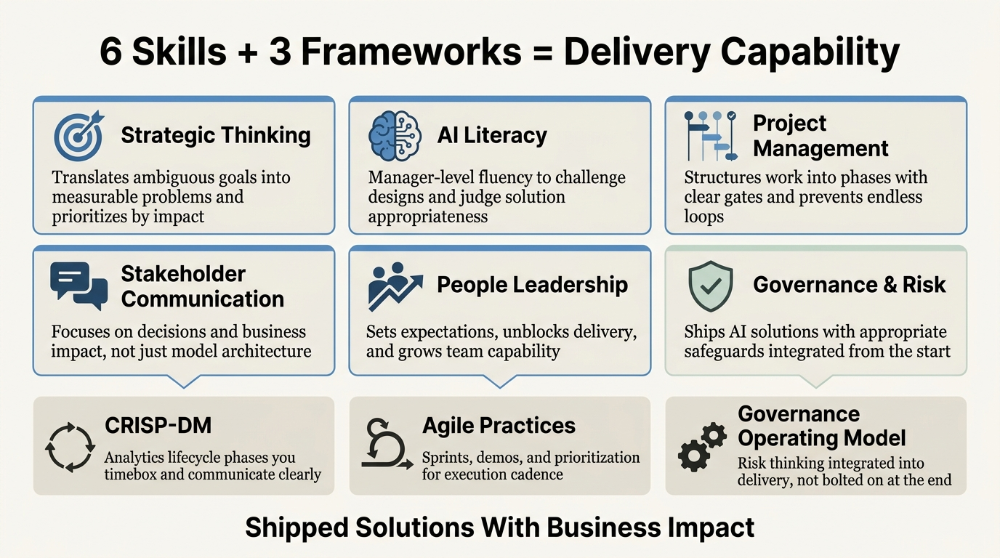

---
authors:
  - rv
categories:
  - Analytics Leadership
comments: true
date: 2026-02-10
description: Six delivery skills and three frameworks turn ambiguous business goals into shipped analytics and AI solutions with measurable outcomes.
draft: false
slug: analytics-ai-manager-delivery-skills
tags:
  - analytics leadership
  - ai management
  - delivery skills
  - frameworks
  - project management
---

# The 6 Delivery Skills Every Analytics and AI Manager Actually Needs

**TL;DR:** Analytics and AI managers succeed not by mastering every technical detail, but by combining six core delivery skills with three repeatable frameworks that translate ambiguous business goals into shipped solutions. The skills are strategic thinking, AI literacy, project management, stakeholder communication, people leadership, and governance. The frameworks are CRISP-DM for analytics lifecycles, Agile practices for execution, and risk-aware governance that integrates into delivery instead of bolting on at the end.

<!-- more -->

Early in my career, I could explain every phase of CRISP-DM and quote Agile principles on demand. What I couldn't do was reliably turn "improve customer experience" into a deployed solution with measurable business impact, until I learned that delivery capability isn't about knowing frameworks, it's about knowing when and how to apply them.

The difference shows up in these moments: when leadership asks "Can we reduce churn with predictive analytics?" and your response is either a vague roadmap or a structured proposal with phases, metrics, risk controls, and realistic trade-offs already mapped out. That gap between theoretical knowledge and practical delivery is where most analytics and AI initiatives stall.

## What Delivery Skills Separate Managers Who Ship From Those Who Just Coordinate?

**Which capabilities matter more than your technical depth?** Six skills create the foundation: strategic thinking that translates "reduce churn" into measurable hypotheses and success metrics, manager-level AI literacy that lets you challenge solution designs and judge whether a proposed model is appropriate without writing the code yourself, project management that structures 12-week pilots into discovery, development, limited rollout, and full deployment with clear exit criteria at each gate, stakeholder communication that focusses on decisions and business impact instead of model architecture, people leadership that sets expectations and unblocks delivery whilst growing team capability, and governance thinking that ships AI solutions with appropriate safeguards instead of triggering last-minute legal panic.

These aren't personality traits. They're trainable capabilities that compound in value as your projects get more complex.

### Strategic and Business Thinking

You translate ambiguous goals into specific problem statements. When someone says "improve customer experience," you turn it into "increase NPS by 5 points and reduce average handle time by 10% via a triage model and GenAI assistant."

You prioritise work by impact, feasibility, and risk, not by what's technically interesting. [Harvard Business School's research on analytics skills](https://analytics.hbs.edu/admissions/top-business-analytics-skills/) confirms that business acumen and stakeholder communication matter more than technical depth for analytics leaders. The analytics roadmap aligns to company strategy, not just interesting models.

### Data and AI Literacy at Manager Level

You understand data sources, quality issues, basic statistics, and ML concepts well enough to challenge assumptions and review solution designs. You don't need to be the best coder, but you must confidently ask "Is our training data representative?" or "What's the cost of a false positive here?"

For AI projects, you're fluent in model types, evaluation metrics like precision and recall, latency requirements, hallucination risk, and data constraints. This lets you judge whether a proposed GenAI solution is appropriate for customer-facing communications or whether it needs human-in-the-loop controls.

### Project and Programme Management

You plan and run analytics and ML projects end to end: scoping, timelines, dependencies, risk management, and status reporting. You use lightweight Agile practices like backlog refinement, sprint goals, demos, and retrospectives to keep data scientists, engineers, and stakeholders moving in sync.

For example, you structure a 12-week pilot into four gates: discovery, model development, limited rollout, and full rollout, with measurable exit criteria at each stage. This prevents projects from drifting into endless "data preparation forever" cycles where nothing ships.

### Stakeholder Management and Communication

You communicate insights and AI trade-offs clearly to non-technical stakeholders, focussing on what decision they need to make and what the business impact is, not just how the model works. You facilitate alignment between executives, product teams, operations, legal, compliance, and technical teams, especially where AI risk is involved.

For instance, you run a decision workshop that surfaces concerns about bias and regulatory risk, then adjust scope and safeguards accordingly before development starts. This prevents the common failure mode where teams build something technically impressive that nobody trusts enough to deploy.

If you're managing analysts or data scientists who need to strengthen these communication fundamentals, [this guide on collaboration in data roles](https://ryannvijay.github.io/blog/2025/02/10/how-to-collaborate-in-data-roles/) covers the stakeholder management patterns that prevent insights from getting ignored.

### People Leadership and Coaching

You lead analysts, data scientists, and engineers by setting clear expectations, giving timely feedback, and unblocking delivery obstacles. You grow capability through mentoring on best practices like experimentation discipline, documentation standards, code review, and MLOps.

You create a culture of curiosity and rigorous thinking instead of just managing task completion. The analysts who develop contextual judgement and stakeholder intuition become more valuable as AI handles more routine work. [Those human skills AI can't replicate](https://ryannvijay.github.io/blog/2024/10/20/human-skills-ai-cant-replicate-data-analysts/) are what your team needs to build deliberately, and you're responsible for creating the feedback loops that develop them.

### Governance, Risk, and Ethics

You understand data governance basics like data minimisation, consent, retention, and PII handling, and how they constrain what you can ship. For AI projects, you own model risk thinking: bias, explainability, monitoring, and controls, working closely with legal and compliance where needed.

For example, you insist on an approval process and ongoing monitoring for a GenAI drafting tool that touches customer communications, rather than "just shipping a chatbot" because the technology is available. [Product School's guide to AI product management](https://productschool.com/blog/artificial-intelligence/guide-ai-product-manager) emphasises that governance isn't a checkbox exercise, it's integral to building AI products people actually trust.

## Which Frameworks Should You Reach for When Structuring Analytics and AI Work?

**What systems cover 90% of what you'll run?** Three frameworks handle most analytics and AI delivery: CRISP-DM (or equivalent data science lifecycle models) as your default operating system for analytics and ML projects with phases you timebox and communicate clearly, Agile product practices including sprints, user stories, A/B tests, and prioritisation frameworks for execution cadence, and governance frameworks that integrate risk thinking into each delivery phase instead of bolting it on as a final legal review.

You don't need a dozen methodologies. You need these three, applied consistently.

### CRISP-DM for Analytics and ML Lifecycles

[CRISP-DM](https://www.datascience-pm.com/crisp-dm-2/) is widely used because it maps well to how organisations think about data projects. The phases are business understanding, data understanding, data preparation, modelling, evaluation, and deployment.

Your delivery skill isn't just "knowing the phases." It's being able to timebox each one and avoid endless iteration loops. You decide when to loop back, for instance when evaluation reveals the need for more representative training data. You communicate progress and risks against this lifecycle to stakeholders who don't speak data science.

Use CRISP-DM as your default operating system, then layer Agile ceremonies on top for sprint planning and regular demos.

### Agile Product Practices for Execution

For analytics work closer to product delivery, you use standard product tools: outcome-based roadmaps, phased rollouts, and dual metrics that track both business outcomes like revenue or NPS and model metrics like accuracy, latency, and adoption rates.

You run sprints or use Kanban boards to manage work, with clear user stories like "As a sales manager, I need a churn risk segment for targeted retention campaigns" and acceptance criteria that define done. You run regular demos of dashboards, models, and AI prototypes to get feedback early and reduce rework.

For AI products and advanced analytics, you set up controlled experiments with clear hypotheses and interpret results rigorously. For GenAI or recommender systems, you combine offline metrics with online A/B testing to judge real-world impact, not just model performance in isolation.

### Governance and Operating Model Frameworks

You implement policies around data ownership, access controls, quality checks, and documentation. Use concepts like data domains, data stewards, and quality SLAs even if you don't formalise a whole framework.

For AI projects, have a simple checklist or stage gate that covers data suitability, fairness assessment, explainability requirements, security controls, human-in-the-loop workflows, monitoring plans, and fallback options. [Voltage Control's research on AI product management](https://voltagecontrol.com/articles/ai-product-management-skills-roles-what-you-need-to-succeed/) shows that successful AI teams integrate these governance checks into delivery milestones, not as a separate compliance stream that slows deployment.

## How Do You Apply These Skills and Frameworks in Practice?

**What does this look like on real projects?** Three examples show different contexts: a classic analytics initiative where you build executive reporting and turn it into action, a regulated environment project combining predictive models with GenAI whilst managing compliance risk, and a capability build across multiple business units where governance and change management matter as much as technical delivery.

Each example demonstrates where delivery skills and frameworks make the difference.

### Classic Analytics Initiative: Executive Dashboard That Drives Decisions

You're asked to "build an executive dashboard" to understand profitability across customer segments. Most teams stop at building charts. You start with business understanding.

You use the CRISP-DM business understanding phase to clarify what decisions leaders can actually pull, not just what they want to see. You translate this into a roadmap: data assessment, MVP dashboard with core metrics, then enhancement based on feedback.

You lead the team through data understanding and preparation: identifying necessary tables, addressing quality issues with source systems, and defining metric definitions in collaboration with finance so numbers reconcile.

You run an iterative delivery cadence using Agile practices: show an early version to executives, gather feedback on which metrics drive decisions versus which are just interesting, adjust visualisations and drill-down paths accordingly.

You ensure governance by defining metric owners, update frequency, and documentation standards so dashboards remain trusted over time instead of becoming "that report nobody believes."

This demonstrates scoping, stakeholder alignment, iterative delivery, communication, and governance skills in a straightforward analytics context.

### Regulatory Reporting Acceleration With AI Compliance Assistant

You're building a predictive model that flags high-risk regulatory reporting items and a GenAI assistant that helps compliance teams draft responses to audit queries. This is common in banking and insurance where regulatory burden is significant.

You use CRISP-DM for the risk flagging model: define risk criteria with the compliance team, select historical audit data whilst navigating what's appropriate to use, engineer features that meet explainability requirements, train the model with a precision-optimised threshold because false negatives are costly.

As analytics and AI manager, you navigate regulatory constraints throughout: what data can be used under privacy rules, what explainability standards apply, what human-in-the-loop workflows satisfy internal audit.

For the GenAI assistant, you act like an AI product manager in a regulated environment: strict prompt guardrails to prevent inappropriate recommendations, citation requirements so every drafted response links to source policy documents, audit trails that log all interactions, and restricted data exposure that prevents the model from accessing confidential customer information.

You plan a controlled rollout: pilot with a small compliance team, measure time savings and accuracy improvements against manual baseline, get legal and compliance sign-off on governance controls before broader deployment.

You implement ongoing governance: version control on prompts, logging of all outputs for audit review, quarterly review cycle with compliance stakeholders, and clear fallback to human-only review when the model flags uncertainty.

This demonstrates risk management in regulated environments, stakeholder alignment across legal, compliance, and operations, and AI deployment with appropriate controls instead of moving fast and breaking things.

### Cross-Business-Unit Analytics Capability Build in a Regulated Organisation

Leadership wants consistent analytics capability across retail banking, commercial banking, and operations, with appropriate data governance and self-serve reporting in an environment where controls aren't optional.

You use strategic leadership skills to define an analytics operating model: data domains by business unit, federated governance with central standards, and tiered self-serve access with curated dashboards for executives, guided exploration for managers, and advanced analytics for specialists.

You break work into programme streams: enterprise semantic layer with shared metrics, data quality framework with clear ownership, training and enablement segmented by user capability, and Power BI deployment with row-level security that enforces data access policies.

You apply CRISP-DM thinking at platform level: make it easier for business analysts to move from business question to data understanding to insight delivery by providing shared components, documented patterns, and reusable feature definitions.

You lead change management: capability assessment by business unit to understand current state, targeted training programmes that meet people where they are, office hours and a centre of excellence for ongoing support, and success stories with internal case studies that demonstrate value and build momentum.

You implement federated governance: clear data ownership with named stewards, access control frameworks that satisfy audit requirements, quality SLAs with monitoring, documentation standards that make data discoverable, and audit trails for regulatory compliance.

This demonstrates programme management across multiple stakeholders, operating model design for regulated environments, capability building with appropriate governance, and change management at scale.

## Your Turn

Start here:

1. **Audit your delivery skill gaps.** Which of the six skills do you rely on others to cover? Strategic thinking, AI literacy, project management, stakeholder communication, people leadership, or governance? Pick one to strengthen deliberately over the next quarter.

2. **Formalise one framework in your team.** If you're running analytics or ML projects without explicit CRISP-DM phases, introduce them in your next project kickoff. If you're not running regular demos or retrospectives, add them to your Agile cadence.

3. **Run a post-mortem through this lens.** Take a recent project that shipped late, missed the mark, or stalled. Map it against the six skills and three frameworks. Where did delivery capability create impact? Where did gaps cause problems?

---

[Connect with me on LinkedIn](https://www.linkedin.com/in/ryan-vijay){ .md-button }

P.S. The teams that ship consistently aren't the ones with the best data scientists or the most advanced infrastructure. They're the ones where delivery skills and frameworks are explicit, practiced, and improved deliberately. Technical capability gets you in the game. Delivery capability keeps you shipping.
