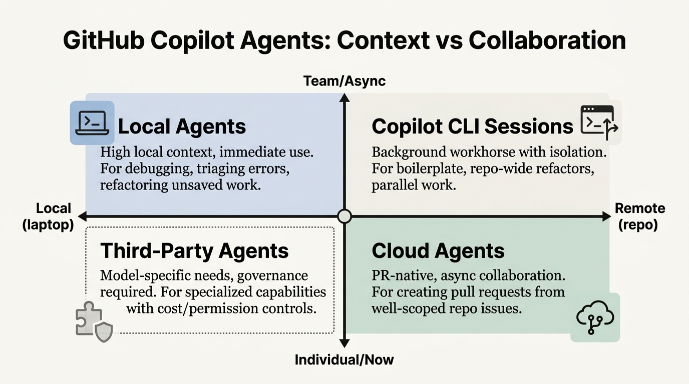

---
authors:
  - rv
categories:
  - AI Tooling
  - AI Adoption
comments: true
date: 2026-01-20
description: How to choose the right GitHub Copilot agent in VS Code, based on context needs, collaboration needs, and security constraints.
draft: false
slug: choose-right-github-copilot-agent-vs-code
tags:
  - github copilot
  - vs code
  - agents
  - copilot cli
  - cloud agents
  - developer productivity
---

# How to Choose the Right GitHub Copilot Agent in VS Code

**TL;DR:** Copilot agents in VS Code are four different execution environments: local agents, Copilot CLI sessions, cloud agents, and third-party agents. They all feel like “Copilot”, but they behave differently because they run in different places. Use one decision framework, context vs collaboration, and you will stop picking the wrong mode and blaming the tool.

<!-- more -->



Most teams are having the same conversation right now.

“Should we let Copilot run as an agent?”

That question is too vague to be useful.

In VS Code, “agent” is not one feature.

It is a set of execution environments with different strengths, different blind spots, and different security trade-offs. VS Code documents this split explicitly across local agents, CLI sessions, cloud agents, and third-party agents.

If you choose well, you get measurable throughput.

If you choose badly, you get a demo that nobody trusts.

This guide gives you a practical way to choose.

---

## Which GitHub Copilot agent should you use in VS Code?

**Answer:** Use local agents when the required context lives on your laptop (unsaved changes, local errors, terminal output). Use Copilot CLI sessions when you want long-running or parallel work, ideally in a Git worktree for clean isolation. Use cloud agents when the output should be a pull request and the repo is the source of truth. Use third-party agents when a specific model or lifecycle control matters, and you are willing to manage cost and permissions.

That is the whole decision.

Everything else is preference.

If you want the official breakdown of what “agents” means inside VS Code, start with the VS Code overview of agents.

- [Using agents in Visual Studio Code](https://code.visualstudio.com/docs/copilot/agents/overview)

---

## Local agents win when the context is on your laptop

**Answer:** If the fastest path to progress is “look at what is in my editor and terminal right now”, you want a local agent. It runs inside VS Code, sees your workspace context, and supports the tight loop of inspect, change, run, fix.

Local agents are the right default when you are:

- **Debugging:** a failing test you just ran
- **Triaging:** lint errors from your local toolchain
- **Refactoring:** code that is not pushed yet
- **Working locally:** files and editor state that are not visible to anything remote

This is why local agents feel “smarter” than a chat tab in a browser.

They live in the same environment as your code.

VS Code calls out that local agents operate within the IDE and use workspace context.

- [Local agents in Visual Studio Code](https://code.visualstudio.com/docs/copilot/agents/local-agents)
- [How Copilot understands your workspace](https://code.visualstudio.com/docs/copilot/reference/workspace-context)

Two practical constraints to set expectations:

**1) Local agents are not a collaboration primitive.**

They are for you, right now, in your VS Code session. If your end goal is an asynchronous PR workflow for a team, you will outgrow this mode quickly.

**2) Local agents are subject to enterprise policy.**

That is a good thing. Regulated organisations should treat local execution like any other developer tool, with settings and guardrails.

If your organisation is already rolling out AI inside the Microsoft stack, the adoption dynamics are the same. You do not get value by “turning it on”. You get value by picking specific use cases and training the workflow, which is exactly why I wrote the [Microsoft Copilot rollout guide](../how-to-use-microsoft-copilot-365/).

---

## Copilot CLI sessions are your background workhorse

**Answer:** If you want an agent to work for 20 minutes while you do something else, use Copilot CLI sessions. They run as a separate process and can keep going even if your VS Code window closes.

This is the mode most teams should adopt for “do the boring work in parallel” tasks:

- **Boilerplate generation:** create the structure so you can focus on logic
- **Repository-wide refactors:** make consistent changes across many files
- **Documentation updates:** keep docs in sync without losing a full day
- **Clean commits:** produce a reviewable change set, not a blob of edits

The killer feature is isolation.

Copilot CLI supports worktree isolation, where the agent works in a separate Git worktree rather than your active working directory.

That matters for two reasons:

- You keep your current workspace clean.
- You can review the agent’s changes like you review a human’s changes.

If your analytics team is still building on shared drives and emailing scripts around, this will sound foreign. It should. Worktree isolation only makes sense if your team is comfortable with branches and review, which is why the [Git and GitHub guide for data analysts](../git-github-guide-data-analysts/) is worth reading first.

Here is the minimal mental model:

```bash
# Your work stays on main
# The agent works in an isolated worktree
# You review and merge when it is ready
```

For the official documentation:

- [Copilot CLI sessions in Visual Studio Code](https://code.visualstudio.com/docs/copilot/agents/copilot-cli)
- [Using GitHub Copilot CLI](https://docs.github.com/copilot/how-tos/use-copilot-agents/use-copilot-cli)

If you want a practitioner view of the workflow patterns, GitHub has also published a concrete walkthrough.

- [Power agentic workflows in your terminal with GitHub Copilot CLI](https://github.blog/ai-and-ml/github-copilot/power-agentic-workflows-in-your-terminal-with-github-copilot-cli/)

One simple adoption metric to track: how many agent outputs make it to a reviewed merge.

If the answer is zero, you have a workflow problem, not an AI problem.

---

## Cloud agents are for pull requests, not personal productivity

**Answer:** If your goal is “produce a PR we can review asynchronously”, use a cloud agent. If your goal is “help me fix what is broken locally”, do not.

Cloud agents run in remote infrastructure.

That gives you two things local execution cannot:

- They can create branches, commit changes, and open PRs.
- They fit naturally into team review workflows.

VS Code’s cloud agent documentation is clear that these sessions run remotely and are repo-centric.

- [Cloud agents in Visual Studio Code](https://code.visualstudio.com/docs/copilot/agents/cloud-agents)

GitHub’s documentation also frames the coding agent as something that produces branch and PR output.

- [About GitHub Copilot coding agent](https://docs.github.com/copilot/concepts/agents/coding-agent/about-coding-agent)

The trade-off is contextual blindness.

Cloud agents cannot see:

- **Unsaved edits:** changes that only exist in your editor
- **Local terminal output:** the errors you are staring at right now
- **Environment drift:** the quirks of your machine, tools, and versions

So if you throw a cloud agent at a failing local build, you will waste time.

But if you throw a cloud agent at an issue that is fully defined in the repo, you will get speed.

This is also where internal collaboration patterns matter.

If your team does not have a mature review habit, the agent will not create it for you.

If you want a practical baseline for those habits, start with [how to collaborate in data roles](../how-to-collaborate-in-data-roles/).

---

## Third-party agents: more capability, more knobs (and more governance)

**Answer:** Use third-party agents when you need model-specific strengths or lifecycle controls. Do not use them casually in enterprise settings. They expand your capability surface area and your risk surface area at the same time.

VS Code supports third-party agents as a first-class concept.

- [Third-party agents in Visual Studio Code](https://code.visualstudio.com/docs/copilot/agents/third-party-agents)

The part most leaders miss is that this is not just a “model swap”.

It changes your operating model.

For example, the research you provided includes premium request multipliers.

A model at 0.33x is not the same budget decision as a model at 3.0x.

A preview “fast mode” at 30.0x is not something you turn on by accident.

This is where governance earns its keep.

You should define:

- **Allowed agent types:** which agents can be used for which repos
- **Permission modes:** what is acceptable for terminal and file edits
- **Audit trail:** what evidence you require before merge

If your organisation is serious about agent extensibility, you also need to understand how tools are exposed to agents.

That is what MCP is for.

- [About Model Context Protocol (MCP)](https://docs.github.com/en/copilot/concepts/context/mcp)
- [Extend your agent with Model Context Protocol](https://learn.microsoft.com/en-us/microsoft-copilot-studio/agent-extend-action-mcp)

---

## The only decision framework you need: Context vs collaboration

Here is the named framework.

Call it the **Context vs Collaboration Matrix**.

It is a two-question decision.

**Question 1: Where does the context live?**

- On your laptop right now
- In the repo and docs that are already pushed

**Question 2: Who needs to consume the output?**

- You, interactively, right now
- Your team, asynchronously, via PR

Map those answers to the four agent types.

- **High local context, low collaboration:** local agent
- **High local context, medium collaboration:** Copilot CLI session in worktree isolation, then PR
- **Low local context, high collaboration:** cloud agent
- **Special model needs, special controls:** third-party agent

If you want to go deeper on what “context” means in VS Code, the workspace context reference is worth reading.

- [How Copilot understands your workspace](https://code.visualstudio.com/docs/copilot/reference/workspace-context)

And if you want the broader Copilot feature surface area in VS Code, start here.

- [AI features in VS Code](https://code.visualstudio.com/docs/copilot/concepts/overview)

If you are building capability plans, treat agent literacy like a real skill. It is starting to sit alongside communication, problem framing, and version control as a baseline expectation. I broke that down in [AI-proof data analyst skills for 2026](../ai-proof-data-analyst-skills-2026/).

---

## A practical workflow: Plan locally, execute in isolation, ship as PR

If you want one workflow that works in regulated enterprise environments, use this:

1. **Plan locally.** Use a local agent to explore the codebase and get the plan and acceptance criteria right.
2. **Execute in isolation.** Delegate to a Copilot CLI session using worktree isolation.
3. **Review like a human change.** You review diffs, run tests, and merge.
4. **Escalate to cloud agents when it is PR-native.** If the task is already well-scoped and repo-contained, let a cloud agent produce the PR.

This is how you keep velocity without losing control.

It also matches how good teams already work, with or without AI.

The goal is not autonomy.

The goal is throughput with an audit trail.

If you are exploring custom agents, GitHub has documentation on how to configure them for the coding agent.

- [Creating custom agents for Copilot coding agent](https://docs.github.com/en/copilot/how-tos/use-copilot-agents/coding-agent/create-custom-agents)

And if you want a realistic view of how messy the taxonomy can get in practice, the community discussion is useful context.

- [Custom Agents vs skills vs instructions discussion](https://github.com/orgs/community/discussions/183962)

---

## Your Turn

Here are four actions you can take this week:

1. **Pick one task and run it end to end.** Not a demo. A real task that ends in a reviewed merge.
2. **Standardise one default choice.** Local agents for debugging, CLI sessions for background refactors, cloud agents for PR-heavy work. Make it explicit.
3. **Adopt worktree isolation for anything non-trivial.** It is the simplest way to keep trust and control.
4. **Track one metric: merge rate.** If agent output does not get merged, you have not created value.

[Connect with me on LinkedIn](https://www.linkedin.com/in/ryan-vijay){ .md-button }

P.S. The fastest way to kill Copilot agents is to treat them like magic. The fastest way to make them useful is to treat them like a junior engineer with infinite stamina and zero context unless you provide it.
