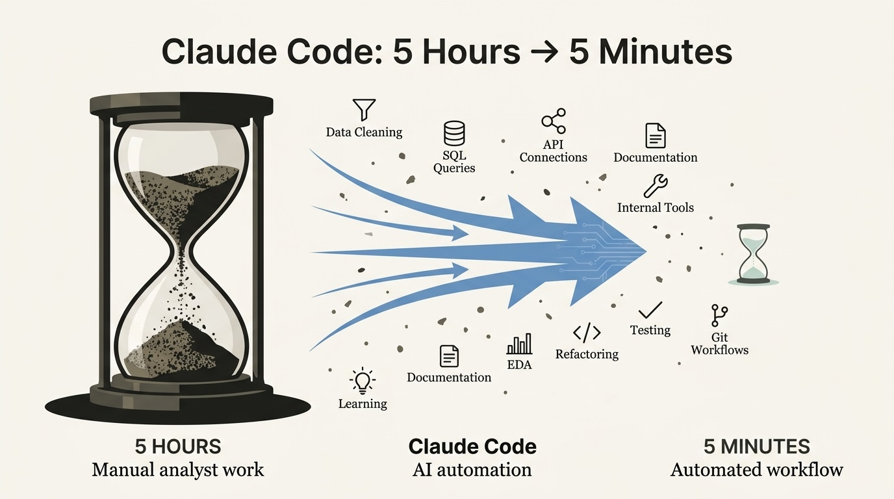

---
authors:
  - rv
categories:
  - AI Tooling
  - Applied AI
comments: true
date: 2026-03-05
description: Claude Code transforms data analyst workflows by automating repetitive tasks. See 10 real use cases that cut workload by 80% with specific examples and time savings.
draft: false
slug: claude-code-data-analysts-10-workflows
tags:
  - claude code
  - data analyst
  - AI tools
  - productivity
  - automation
  - python
  - SQL
---

# Claude Code for Data Analysts: 10 Workflows That Turn 5-Hour Tasks Into 5-Minute Ones

**TL;DR:** Claude Code transforms how data analysts work by automating the tedious parts: cleaning messy data, writing SQL queries, generating documentation, and building internal tools. This article walks through 10 real workflows that turn five-hour tasks into five-minute ones. You'll see exactly how to apply each use case to your own work, with specific examples and time savings from an analyst who uses this tool daily.

<!-- more -->



The data analyst role is changing faster than SQL syntax updates. The analysts pulling ahead are not the ones spending more time learning Python; they are the ones using AI to do in five minutes what used to take five hours.

I have spent 15 years in analytics across banking, insurance, utilities, and automotive finance. I have never seen a tool change how I work as fast as Claude Code did. Not because it writes perfect code every time. Because it eliminates the repetitive execution that distracts from actual analysis.

This is not a tutorial on prompting techniques or a vendor pitch. It is 10 workflows I use multiple times per week, with specific scenarios, time savings, and honest limitations. If you are drowning in data cleanup, manual SQL queries, or documentation debt, these workflows will change how you spend your time.

## The Gap Opening Right Now in Data Analytics

AI coding tools are creating a skill divide in analytics.

Analysts who adopt tools like Claude Code get 5-10x productivity gains on repetitive tasks. Data cleanup that took an afternoon now takes five minutes. SQL queries that required 30 minutes of joins and subqueries now take two. Documentation you skipped because it was not urgent gets written automatically.

The analysts who resist are spending hours on work that could be automated.

This is not about replacing analytical thinking. It is about replacing the tedious execution that prevents you from doing more of it. Let me show you exactly how.

## What Skills Will Be Critical for Data Analysts in 2026?

Before diving into workflows, understand where this fits. [AI-proof data analyst skills](https://ryannvijay.github.io/blog/2025/11/17/ai-proof-data-analyst-skills-2026/) are not about knowing more Python syntax. They are about knowing when to automate, when to validate AI outputs, and when to apply human judgement.

Claude Code handles the "how to implement this" part. You handle the "what problem am I solving and is this answer correct" part.

That division matters. Now let me show you the 10 workflows that make it real.

## Use Case 1: How Does Claude Code Handle Messy CSV Files?

You receive a CSV from a colleague. Multiple date formats. Inconsistent capitalisation. Duplicate rows. Missing values. Seven distinct issues that would take 30 minutes to fix manually in Excel.

You give Claude Code the file, describe the problems, and it writes Python code to clean everything in seconds.

Here is what it fixes automatically:

- **Standardising date formats:** Converts "01/15/2024", "2024-01-15", and "January 15, 2024" to a single ISO format
- **Normalising text fields:** Fixes capitalisation inconsistencies (New York vs new york vs NEW YORK)
- **Removing duplicates:** Identifies and drops exact duplicate rows based on specified columns
- **Filling missing values:** Applies forward fill, backward fill, or default values depending on the field
- **Validating data types:** Ensures numeric columns contain numbers, not strings
- **Trimming whitespace:** Removes leading and trailing spaces that break joins later
- **Creating data quality reports:** Generates a summary of issues found and fixes applied

The code it writes is production-ready Python with pandas. You review it, run it, and move on. Five minutes instead of 30.

The limitation: you need to describe the issues clearly. "Clean this file" produces generic code. "Standardise dates to ISO format, capitalise region names, remove rows where order_id is duplicated" produces exactly what you need.

## Use Case 2: Can Claude Code Generate Exploratory Data Analysis Automatically?

Yes, and it is faster than writing the same matplotlib and seaborn code you have written 50 times before.

Point Claude Code at your dataset. Ask for exploratory analysis. It generates summary statistics, distributions, correlation matrices, and visualisations with a single prompt.

Here is what you get:

- **Descriptive statistics:** Mean, median, standard deviation, quartiles for all numeric columns
- **Missing data analysis:** Percentage of nulls per column, heatmap showing missing patterns
- **Distribution plots:** Histograms and density plots for continuous variables
- **Categorical summaries:** Value counts and bar charts for categorical fields
- **Correlation analysis:** Heatmap showing relationships between numeric variables
- **Outlier detection:** Boxplots and z-score calculations flagging anomalies

This is the first-pass analysis you would manually code in 30 minutes. Claude Code does it in two.

When to use it: initial data exploration before deeper investigation. When not to use it: when you need domain-specific visualisations or custom metrics that require business logic.

## Use Case 3: Connecting to APIs Without Memorising Documentation

Every analyst has pulled data from an API. Most have spent 15 minutes reading documentation to figure out authentication, endpoint structure, and JSON parsing.

Claude Code skips that step.

Give it the API documentation URL or describe the endpoint. It writes the authentication logic, constructs the request, handles pagination, parses the JSON response, and loads it into a pandas DataFrame.

Example: pulling customer transaction data from a REST API with OAuth authentication. Normally you would:

1. Read the API docs to understand the OAuth flow
2. Write code to get the access token
3. Construct the GET request with headers
4. Handle pagination if results exceed one page
5. Parse nested JSON into a flat DataFrame

Claude Code does all five steps in one go. You get a complete script that runs without modification.

The catch: if the API returns deeply nested JSON with inconsistent structure, you might need to adjust the parsing logic. But even then, Claude Code gives you 80% of the solution immediately.

## Use Case 4: How Accurate Is Claude Code at Generating SQL Queries?

If you describe the business logic clearly, Claude Code writes production-quality SQL including joins, CTEs, window functions, and filters.

Here is a real scenario. You need a customer segmentation query: customers who made at least three purchases in the last 90 days, with total spend over £500, segmented by region.

Describe that in plain language. Claude Code generates:

```sql
WITH recent_purchases AS (
    SELECT
        customer_id,
        region,
        COUNT(DISTINCT order_id) AS purchase_count,
        SUM(order_value) AS total_spend
    FROM orders
    WHERE order_date >= CURRENT_DATE - INTERVAL '90 days'
    GROUP BY customer_id, region
)
SELECT
    customer_id,
    region,
    purchase_count,
    total_spend,
    CASE
        WHEN total_spend > 1000 THEN 'High Value'
        WHEN total_spend BETWEEN 500 AND 1000 THEN 'Medium Value'
        ELSE 'Low Value'
    END AS customer_segment
FROM recent_purchases
WHERE purchase_count >= 3 AND total_spend > 500
ORDER BY total_spend DESC;
```

That query took 30 seconds to generate. Writing it manually: 15-20 minutes, depending on how rusty you are with window functions and CTEs.

For complex queries with multiple joins, subqueries, and conditional logic, the time savings multiply. Compare this to [how ChatGPT handles data analysis tasks](https://ryannvijay.github.io/blog/2024/12/29/chatgpt-for-data-analysts/): Claude Code produces cleaner, more maintainable SQL because it is designed for code generation.

The limitation: if your schema is non-standard or poorly documented, Claude Code might make incorrect assumptions about table relationships. Always review the joins.

## Use Case 5: Can Claude Code Write Documentation for Existing Code?

Point it at a Python script or SQL query and ask for documentation. It generates docstrings, inline comments explaining logic, and README files that describe what the code does and how to use it.

This matters for team collaboration. You inherit a 300-line Python script with no comments. You have no idea what it does. Normally you would spend 20 minutes reading through it, tracing the logic, and adding your own notes.

Give it to Claude Code. It generates:

- **Module-level docstring:** High-level summary of what the script does
- **Function-level docstrings:** Purpose, parameters, return values, and exceptions for each function
- **Inline comments:** Explanations for complex logic blocks
- **README:** How to run the script, required inputs, expected outputs, and dependencies

Five minutes of documentation that you would have skipped because it was not urgent. Now your teammates can understand and modify the code without asking you.

This is especially useful for SQL queries. Claude Code explains what each CTE does, why the joins exist, and what business logic the filters implement. Turn incomprehensible legacy queries into maintainable code.

## Use Case 6: Building Internal Tools in Hours, Not Days

Small internal dashboards and data apps usually sit in the backlog forever. Not because they are hard to build. Because you do not have 8 hours to scaffold a Flask app, write backend logic, and generate frontend HTML.

Claude Code changes that timeline.

Example: your team needs a simple dashboard to visualise weekly KPIs. Normally this is a day-long project: set up the app structure, write Python to query the database, generate charts, and create a basic HTML interface.

With Claude Code, you describe what you want. It scaffolds the entire structure in 15 minutes:

- **Backend:** Flask or FastAPI routes that query your database and return JSON
- **Frontend:** HTML templates with Chart.js or Plotly visualisations
- **Configuration:** Requirements file, environment variable handling, and deployment instructions

You spend the remaining time tweaking styling and adding business-specific features. The tedious scaffolding is done.

The same applies to Streamlit apps for team analytics, Jupyter notebooks for exploratory analysis, or simple automation scripts. Tools you would not have built because they were not worth a full day suddenly become feasible in an hour.

## Use Case 7: Does Claude Code Improve Messy Code Automatically?

Give it a working but inefficient script and ask it to refactor. It rewrites for readability, removes redundancy, adds error handling, and optimises performance.

Example: you have a 200-line script with nested loops processing a DataFrame row by row. It works, but it takes 10 minutes to run on a dataset with 100,000 rows.

Claude Code refactors it to vectorised pandas operations. Your 200-line script becomes 80 lines of clean, maintainable code. Runtime drops from 10 minutes to 15 seconds.

Here is what refactoring includes:

- **Vectorisation:** Replaces loops with pandas apply, vectorised operations, or numpy functions
- **Error handling:** Adds try-except blocks around risky operations
- **Code structure:** Breaks monolithic scripts into functions with clear responsibilities
- **Type hints:** Adds Python type annotations for better IDE support and documentation
- **DRY violations:** Removes repeated code blocks and extracts them into reusable functions

When to use it: when you have working code that is slow, hard to understand, or fragile. When not to use it: when the code is already clean and the bottleneck is external (database query time, API latency).

## Use Case 8: Testing and Debugging Code Faster

Writing unit tests is one of those tasks analysts skip. Not because it is unimportant. Because it is time-consuming and your manager cares about delivered analysis, not test coverage.

Claude Code writes unit tests automatically. Point it at a function, ask for tests, and it generates test cases covering normal inputs, edge cases, and error conditions.

Example: you have a function that calculates customer lifetime value. Claude Code generates:

```python
def test_calculate_clv_normal():
    assert calculate_clv(purchases=5, avg_value=100, retention=0.8) == 400

def test_calculate_clv_zero_purchases():
    assert calculate_clv(purchases=0, avg_value=100, retention=0.8) == 0

def test_calculate_clv_invalid_retention():
    with pytest.raises(ValueError):
        calculate_clv(purchases=5, avg_value=100, retention=1.5)
```

Five tests in 30 seconds. Writing them manually: 10-15 minutes.

Debugging is even faster. When a script fails with a cryptic error, paste the error message and the relevant code into Claude Code. It explains what went wrong, why it happened, and suggests a fix.

This is particularly useful for data pipeline failures where the error is buried in a 500-line traceback. Claude Code isolates the root cause and proposes a solution.

## Use Case 9: How Does Claude Code Help with Git Workflows?

Git intimidates analysts who come from Excel and SQL backgrounds. Merge conflicts, commit messages, branching strategies, and .gitignore files feel like unnecessary complexity.

Claude Code lowers that barrier.

Here is what it handles:

- **Commit messages:** Generates clear, descriptive commit messages following best practices
- **Merge conflicts:** Explains what each conflicting section does and suggests the correct resolution
- **.gitignore files:** Creates appropriate .gitignore entries for your project type (Python, R, Jupyter notebooks)
- **Git commands:** Translates plain language requests into correct Git commands with explanations

Example: you want to undo the last commit without losing your changes. Instead of Googling "git undo last commit", you ask Claude Code. It responds:

```bash
git reset --soft HEAD~1
```

And explains: "This moves the branch pointer back one commit while keeping your changes staged. Use `--mixed` to unstage them or `--hard` to discard them entirely."

For analysts working in cross-functional teams who need version control but do not have time to master Git, this is the entry point. Learn by doing with an AI assistant that explains as it goes.

If you are still getting comfortable with version control, see [this guide on Git and GitHub for data analysts](https://ryannvijay.github.io/blog/2025/10/24/git-github-guide-data-analysts/) for the fundamentals.

## Use Case 10: Learning New Tools and Frameworks Without Multi-Week Investments

You need to pick up a new Python library. Maybe your team is migrating from pandas to Polars for performance. Maybe you need to learn SQLAlchemy for database ORM.

Normally this is a multi-day investment: read the docs, follow tutorials, translate your existing workflows into the new syntax.

Claude Code compresses that timeline. Give it your existing pandas code and ask it to translate to Polars. It converts the syntax, explains the differences, and highlights performance implications.

Example: you have a complex pandas pipeline with groupby, merge, and apply operations. Claude Code translates it to Polars and explains:

> "Polars uses lazy evaluation, so operations are not executed until you call `.collect()`. This allows query optimisation across the entire pipeline. The `.with_columns()` method is preferred over pandas' `.assign()` because it is more explicit about column creation."

You learn by seeing your own code in the new framework, not by working through generic examples. This accelerates learning from weeks to days.

The same applies to new visualisation libraries, cloud services, or database tools. Claude Code acts as a learning accelerator, translating what you already know into the new system.

For a broader view of which tools and skills matter most, see [how to evaluate GitHub Copilot agents](https://ryannvijay.github.io/blog/2026/01/28/choose-right-github-copilot-agent-vs-code/) for a comparison of AI coding tools.

## The Bottom Line

Claude Code does not replace analytical thinking. It replaces the tedious execution that distracts from it.

Here is what changes:

**Stop spending hours on repetitive code.** Data cleanup, SQL generation, and documentation take minutes instead of hours. You get back 5-10 hours per week to focus on actual analysis.

**Build tools you would not have had time for.** Internal dashboards, automated workflows, and testing suites become feasible. Projects that sat in the backlog for months get built in an afternoon.

**Learn faster.** New tools and frameworks are no longer multi-week investments. Claude Code explains and translates as you go, compressing the learning curve from weeks to days.

The skill gap opening right now is not Python vs R or SQL vs NoSQL. It is AI-augmented analyst vs manual analyst. One finishes in a morning what the other finishes in a week.

If you are serious about [problem-solving as a data analyst](https://ryannvijay.github.io/blog/2025/07/11/data-analyst-problem-solving/), adopting AI coding tools is not optional. It is the difference between spending your time on execution and spending it on insight.

---

[Connect with me on LinkedIn](https://www.linkedin.com/in/ryan-vijay){ .md-button }

P.S. Want to see these workflows in action? Follow along in your own environment. The best way to evaluate Claude Code is to give it a messy CSV and see what happens. Start with Use Case 1 and work through the list. You will know within an hour whether this changes how you work.
