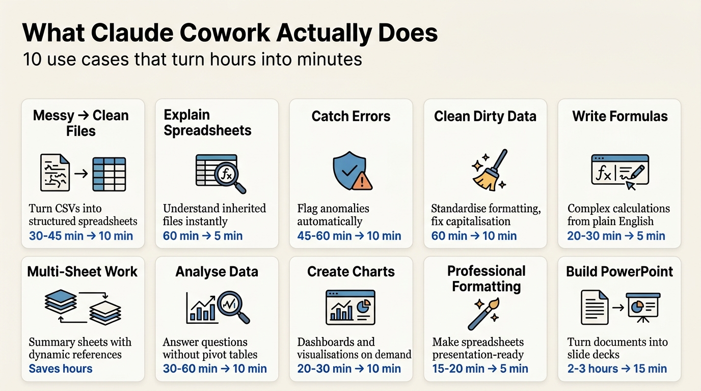

---
authors:
  - rv
categories:
  - AI Tooling
comments: true
date: 2026-03-15
description: Claude Cowork automates spreadsheet cleaning, formula writing, and presentation building through plain English prompts. Here's what it actually does.
draft: false
slug: claude-cowork-automates-excel-powerpoint
tags:
  - claude cowork
  - ai tools
  - productivity
  - excel automation
  - powerpoint
  - data cleaning
---

# Claude Cowork Automates Excel and PowerPoint in Minutes: What It Actually Does

**TL;DR:** Claude Cowork automates spreadsheet cleaning, formula writing, data analysis, and presentation building through plain English prompts. It turns messy CSVs into formatted Excel files, writes complex formulas you'd normally look up, catches data errors you'd miss, and builds slide decks from documents. Not perfect, requires review, but for routine data work it saves hours. Here's what it actually does well and where it still needs you.

<!-- more -->

You can spend three hours cleaning a messy CSV, writing formulas, and formatting a slide deck. Or you can describe what you want in plain English and let Claude Cowork do it in ten minutes.

That's the promise. Here's what actually happens when you use it.

## What is Claude Cowork?

Claude Cowork is Anthropic's AI assistant that accesses files and folders on your computer to automate document work. Unlike standard Claude, which just chats, Cowork reads your spreadsheets, writes formulas, catches errors, and builds presentations.

You describe what you want. It does the work.

The tool runs through Claude's desktop app, not the website. It accesses a folder you choose on your computer. From there, you give it tasks in plain English and it handles the technical execution.

Here's what that looks like in practice.

## Where Cowork Saves Real Time: The 10 Use Cases

Most AI productivity tools promise everything and deliver surface-level automation. Cowork is different. It handles ten specific scenarios where spreadsheet and presentation work eats hours of your week.

I'm walking through each one with concrete examples. No marketing fluff. Just what it does, how well it works, and where it still needs you to check its output.

## Use Case 1: Turn Messy Files Into Structured Spreadsheets

**What happens:** You hand Cowork a messy CSV or text file with terrible formatting. It converts it to a clean Excel spreadsheet with proper headers, structured columns, and readable formatting.

Here's a real example.

A CSV export with inconsistent delimiters, swapped columns, and no clear structure. You tell Cowork: "Take this CSV and turn it into a clean formatted Excel spreadsheet with proper headers."

Ten minutes later, you get a file with clean headers, standardised formatting, and a total column that sums your data. No manual copy-pasting. No formatting by hand.

The same works for text files. A contact list stored as plain text with names, emails, phone numbers, and departments all jumbled together? Cowork reads it, identifies the patterns, and builds a structured spreadsheet with columns for each field.

**Time saved:** What would take 30-45 minutes of manual work happens in under 10.

## Use Case 2: Explain Spreadsheets You've Inherited

**What happens when you inherit a complex spreadsheet:** You open it and have no idea what you're looking at. Formulas reference other sheets. Columns have no labels. Logic makes sense only to the person who built it.

You ask Cowork: "I just inherited this spreadsheet from a coworker. Can you explain what it does in plain English?"

It reads the file and tells you:
- What each sheet calculates
- What every formula does and why
- Which cells are hardcoded values that should be formulas
- What breaks if data changes

**Real example:** A sales tracker with quarterly data, commission calculations, and a summary sheet. Cowork identified that the "top rep" cell was hardcoded instead of using a formula. When sales numbers changed, the cell wouldn't update automatically.

That's the kind of risky detail you'd miss until something broke.

You can also ask: "Walk me through the formulas in this file. What is each one calculating and why?" It explains the logic behind every calculation, making it easy to maintain or modify the spreadsheet without reverse-engineering it yourself.

**Time saved:** Understanding a complex spreadsheet drops from 60 minutes of detective work to 5 minutes of reading Cowork's explanation.

## Use Case 3: Catch Errors and Anomalies Automatically

**What happens:** Errors in spreadsheets hide in plain sight. A date in the future. A duplicate order ID. A negative quantity that makes no sense. A total that doesn't match the line items.

You tell Cowork: "Review this spreadsheet and flag anything that looks like an error, anomaly, or red flag."

It scans the file and catches:
- **Duplicate IDs:** Two completely different orders sharing the same identifier
- **Future dates:** A 2027 order date in a 2024 data set
- **Corrupted dates:** Excel's zero date (1900) indicating a null value misread as a number
- **Negative quantities:** A sale with -3 units
- **Invalid names:** A customer name that's just a string of digits
- **Math errors:** A total that doesn't match quantity times unit price

Six errors flagged. Then Cowork asks: "Want me to fix all of these and save a cleaned version of the file?"

You say yes. It handles the corrections, highlights cells that need manual review, and saves the clean file with a new name so you still have the original.

**Time saved:** Manual data quality checks take 45-60 minutes. Cowork does it in under 10.

## Use Case 4: Clean Dirty Data in Minutes

**What dirty data looks like:** Inconsistent capitalisation. Phone numbers in three different formats. State names spelled as "New York," "NY," and "New York." Random blank cells. Duplicate rows.

This is the tedious work that makes data projects painful.

You tell Cowork: "Clean up this spreadsheet. Standardise all the formatting, fix capitalisation, and make it consistent throughout."

It doesn't just start. It asks clarifying questions first:
- "How should I handle rows with missing industry values? Fill as 'unknown' or leave blank?"
- "What phone format should I standardise to?"
- "What date format do you want?"

You answer. Then it gets to work.

**What Cowork fixes:**
- **Names:** Proper case for first and last names
- **Emails:** Lowercase throughout
- **Phone numbers:** Standardised to one format across all rows
- **States:** Two-letter abbreviations (CA, NY, TX)
- **Dates:** Consistent format (DD/MM/YYYY)
- **Missing values:** Filled with "unknown" where you specified
- **Duplicates:** Flagged and removed

You get a clean file with colour-coded headers and standardised data. What would take an hour of manual find-and-replace work happens in minutes.

**Bonus:** Cowork catches duplicates you didn't even ask it to find.

## Use Case 5: Write Complex Formulas

**The formula problem:** You know what you want to calculate. You just don't want to look up the syntax, test it, and debug when it breaks.

Cowork writes formulas from plain English descriptions.

**Examples:**
- "Add a profit margin column that calculates the margin as a percentage of revenue."
- "Create a running total column that shows cumulative revenue as you go down the rows."
- "Add a column that flags any sale where the discount is greater than 20% with the word 'review'."
- "Write a formula that calculates how many days ago each sale was made."
- "Add a commission column: 8% for sales under £5,000, 10% for £5,000 to £10,000, and 12% for anything above."

It writes the formulas, applies them across all rows, and includes error handling with `IFERROR` that you'd probably skip if you were writing it manually.

The tiered commission formula is the kind of nested IF statement most people have to look up every time. Cowork writes it instantly and applies it to 50 rows in one go.

**Time saved:** Writing and testing five formulas manually takes 20-30 minutes. Cowork does it in under 5.

## Use Case 6: Work Across Multiple Sheets

**The multi-sheet problem:** Your data is split across separate sheets for each region (North, South, East, West). You need a summary sheet that pulls total revenue from each region into one table.

You tell Cowork: "I have data on separate sheets for each region. Create a new summary sheet that pulls the total revenue from each region into one table."

It builds the summary with formulas that reference the regional sheets. Then you ask: "If I add a new row to any regional sheet, will the summary update automatically? If not, fix it."

Cowork checks, finds that the ranges are hardcoded, and rewrites the formulas to use dynamic ranges. Now when you add new data, the summary updates without manual intervention.

**This is the difference between a spreadsheet that works once and one that keeps working.**

## Use Case 7: Analyse Data Without Pivot Tables

**What happens:** You have a data set and questions. You could build pivot tables, write complex formulas, and manually dig through rows. Or you could ask Cowork in plain English.

**Questions you can ask:**
- "Summarise the key trends in this data set. What stands out to you?"
- "Which product category is bringing in the most revenue?"
- "Who are the top five customers by total spend?"
- "Is there a pattern to which days of the week have the highest sales?"

Cowork reads the data and answers with specifics.

**Real example:** A sales data set with 50 orders across six months. Cowork identified:
- Electronics account for 60% of total revenue
- June had a massive spike in sales
- Gold-tier customers drive the most volume
- Friday and Saturday alone account for 58% of sales
- The top customer spent nearly £600 more than the second-place customer

Then it wrote a three-sentence executive summary you could paste directly into Slack: "E-commerce snapshot January through June 2024. Across 50 orders we generated £X in revenue. Electronics and gold-tier customers dominate. Friday and Saturday alone account for 58% of sales. Top customer contributed £3,650 by himself."

**Time saved:** Manual analysis with pivot tables and filters takes 30-60 minutes. Cowork does it in under 10.

## Use Case 8: Create Charts and Dashboards

**What happens:** Raw numbers in a spreadsheet are hard to read at a glance. A chart changes that instantly.

You tell Cowork: "Create a bar chart showing total revenue by month."

It generates the chart. You can copy the image or ask it to keep building.

**More complex requests:**
- "Add a line chart that shows both revenue and expenses on the same chart so I can see the trend."
- "Apply conditional formatting to the profit column. Colour-code it so I can see good and bad months at a glance."
- "Add a colour scale to the conversion rate column."
- "Create a simple dashboard view on a new sheet that shows key metrics at a glance."

Cowork builds the dashboard with summary metrics, colour-coded columns, and charts. It's not publication-ready visualisation, but for internal reporting it's more than good enough.

If you need something more polished, you can also ask for an HTML dashboard instead. But for most uses, the in-spreadsheet version works fine.

**Time saved:** Building charts and dashboards manually takes 20-30 minutes. Cowork does it in under 10.

## Use Case 9: Make Spreadsheets Look Professional

**The formatting problem:** Your spreadsheet works. The data is accurate. The formulas are correct. But it looks terrible.

No formatting. Inconsistent column widths. Numbers without currency symbols. You wouldn't send this to a client or your manager.

You tell Cowork: "Make this spreadsheet look professional. Clean up formatting, add proper headers, make it presentable."

**What Cowork fixes:**
- Adds a colour-coded header row
- Standardises column widths
- Formats currency and percentages correctly
- Adds borders and shading for readability
- Creates visual hierarchy so the important data stands out

What you get is a file that looks like someone spent time on it, not a raw data dump.

**Time saved:** Manual formatting takes 15-20 minutes. Cowork does it in under 5.

## Use Case 10: Build PowerPoint Presentations From Documents

**The PowerPoint problem:** You've written a 14-page business plan, research brief, or investment memo. Now you need to turn it into a slide deck for a presentation.

Building slides by hand takes hours. You have to decide which points go on which slides, format everything, create visual hierarchy, and make it look cohesive.

You tell Cowork: "I need help building a PowerPoint presentation. Keep this high-level. I'm pitching this company to investors. Build the presentation from this document. At most, I want eight slides. Do not include the title slide as part of the eight."

Cowork reads the document. Then it asks clarifying questions:
- "The document doesn't mention specific investment terms. What should the deck tell investors about how much you're raising and what you're offering in return?"
- "Which eight slides should I prioritise? Here's my recommended structure."

You answer. Cowork builds the deck.

**What you get:** Nine slides (title plus eight content slides) with clean formatting, visual variety, and consistent design. The slides aren't boring. Different layouts. Colour variation. Readable hierarchy.

If your company has a brand style, you can provide a `claude.md` file with your colour palette, fonts, and layout rules. Cowork follows those guidelines exactly.

After it builds the deck, you can make changes: "Can we change the subtitle on the title slide?" It updates the file instantly.

**Time saved:** Building a slide deck from a document takes 2-3 hours. Cowork does it in 10-15 minutes.

## What Cowork Gets Wrong: Where You Still Need to Check

Cowork is good. It's not perfect.

**Things to watch for:**
1. **Preview lag:** The in-app spreadsheet preview doesn't always update immediately. The actual file is correct, but you might need to open it in Excel or Google Sheets to see the latest changes.
2. **Rate limits:** If you hit Anthropic's usage limits, the work pauses until your limit resets. Annoying, but rare unless you're running massive tasks back-to-back.
3. **Sleep mode issues:** Your computer must stay awake while Cowork runs. If it goes to sleep, the task stops. Adjust your settings before starting big jobs.
4. **Date formatting quirks:** Sometimes date corrections add timestamps you didn't ask for. Easy to fix, but worth checking.
5. **Human judgement still required:** Cowork can't decide what matters to your business, what data is confidential, or what strategic direction makes sense. It automates execution. You still own the decisions.

The biggest mistake people make is trusting AI output without review. Cowork is a productivity multiplier, not a replacement for thinking.

Check the output. Confirm the logic. Make sure it did what you actually needed.

## The Bottom Line

Claude Cowork handles routine spreadsheet and presentation work faster than you can do it manually. Cleaning data, writing formulas, catching errors, building slide decks: all of it happens in minutes instead of hours.

But it's a tool, not a strategy. It won't fix bad data governance. It won't replace knowing what questions to ask. And it won't make decisions for you.

What it does do is free up time for the work that actually requires your judgement. If you spend hours each week on spreadsheet tedium, Cowork changes what's possible.

For [enterprise teams already using AI tools](https://ryannvijay.github.io/) or evaluating [where AI fits in analytics workflows](https://ryannvijay.github.io/), Cowork is worth testing. The learning curve is minimal. The time savings are real.

Just remember: [human skills AI can't replicate](https://ryannvijay.github.io/) still matter. Cowork handles the execution. You handle the thinking.

---

## Your Turn

If you're spending more than two hours a week cleaning spreadsheets, writing formulas, or formatting presentations, try Cowork on one task. Pick something tedious and repetitive. See what happens.

The tool works best when you:
1. Start with a clear task description
2. Answer its clarifying questions
3. Review the output before using it
4. Adjust and iterate until it matches what you need

[Connect with me on LinkedIn](https://www.linkedin.com/in/ryan-vijay){ .md-button }

P.S. The future of productivity tools isn't "AI does everything." It's "AI does the tedious work so you focus on what matters." Cowork gets that right.
