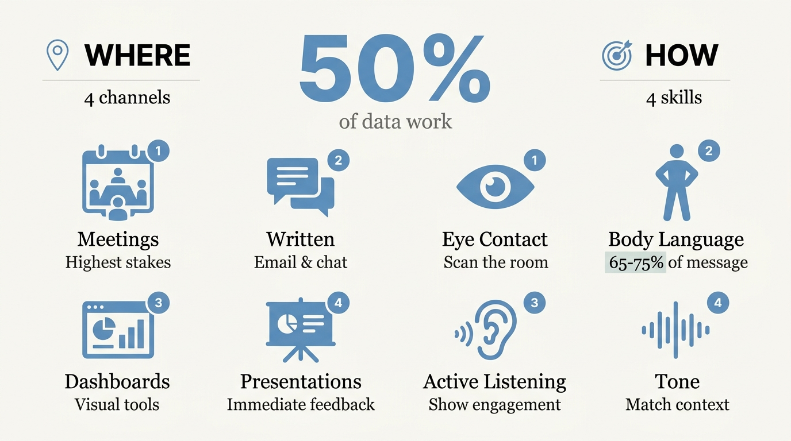

---
authors:
  - rv
categories:
  - Analytics Leadership
  - Career and Growth
comments: true
date: 2025-12-20
description: Communication is 50% of the job in data roles. Here are the four
  channels and four practical skills every data analyst needs to master.
draft: false
slug: communication-skills-data-analyst
tags:
  - communication skills
  - data analyst
  - presentation skills
  - stakeholder communication
  - active listening
  - body language
  - analytics leadership
---

# Communication Is 50% of the Job in Data Roles. Here Is How to Do It Well.

**TL;DR:** Most data analysts expect to spend the majority of their time with data. They are wrong. Communication is roughly 50% of the work: across meetings, written messaging, dashboards, and formal presentations. When you do it poorly, technically strong work loses credibility in the room. The four skills that change that most (eye contact, body language, active listening, and tone) are not personality traits. They are learnable behaviours.

<!-- more -->

Most people entering data roles expect to spend most of their time with data. They are in for a surprise.

I was. I started out thinking I would sit at a desk, run some queries, send tidy emails, and mostly get on with it. What I found instead was that almost nothing moved without communicating with someone first. Data access required asking the right person. Understanding what a business stakeholder actually needed required sitting in meetings. Delivering the output meant presenting findings to a room of people who expected clarity and confidence. None of that happens quietly.

## How Much of Your Data Job Is Actually Communication?

Communication accounts for roughly 50% of getting your job done in a data role. Not a rough estimate. A practical reality that catches most people off guard when they first enter the field.

There are four main channels that carry that communication:

- **Meetings:** Standups, stakeholder sessions, discovery workshops, presentations. These are the highest-stakes settings and the ones most people feel least prepared for. Your manager will ask you to lead a presentation before you feel ready for it.
- **Written messaging:** Email for external stakeholders and formal communications; Slack or Teams for your team. Writing is a communication skill. A wall of text with no structure is a communication failure, even if the content is accurate.
- **Dashboards:** A dashboard is a communication tool. If someone opens it and does not immediately grasp what you are trying to show them, you have not finished the job.
- **Formal presentations:** The one that catches new analysts off guard most often. You will be in charge of explaining findings, answering questions, and holding a room of senior stakeholders. Nothing in the technical parts of the job prepares you for it.

Each channel breaks differently. Most analysts get comfortable with written messaging first, because the feedback loop is slow and forgiving. Meetings and presentations are different. The feedback is immediate and visible.

## Why Nobody Warned You That Data Work Is This Collaborative

I wanted to be heads-down. That was the appeal of data work: a clear problem, a defined output, and mostly independent execution.

The reality is that almost every step of a data project has a communication dependency. You need someone to explain the business problem before you can define the analysis. You need someone to grant you access to the systems you require. You need to circulate your findings with enough clarity that stakeholders can act on them, not just nod and move on. Then you need to gather feedback, iterate, and present again.

If you pulled communication down to 10% of your working time, your effectiveness would drop to near zero. Not because of a technical limitation. Because the flow of a project depends on constant back-and-forth: asking the right questions, confirming what you understood, adapting outputs based on feedback.

This is not intuitive when you are coming from a degree programme focused almost entirely on technical skill. It becomes obvious in the first few months of a real role.

## Does Poor Communication Actually Hurt a Technically Strong Analyst?

Yes. And faster than most people expect.

Poor communication does not just obscure good work. It makes people question whether to trust it. I have watched technically accurate analysis presented poorly to senior stakeholders who left the room uncertain about the conclusions, not because the analysis was wrong, but because the delivery said the presenter was not confident in it.

The people who are genuinely difficult to work with are rarely the ones who challenge decisions or ask hard questions. They are the ones where every interaction requires extra effort: vague email responses, an unintentionally negative tone in casual conversations, a flat delivery during meetings that makes everything feel uncertain. Technically competent people can still be exhausting to collaborate with, and managers notice this quickly.

The other place this surfaces is in interviews. Hiring managers for data roles know they are placing someone into cross-functional meetings, executive briefings, and client presentations. They are watching your eye contact, body language, and tone during the interview because they are already assessing what you will be like in those rooms. Poor communication before you have the job answers their question before you have finished saying what your technical skills are.

The four things that close that gap are all learnable. None of them are fixed traits.

## What Does Good Eye Contact Look Like When Presenting Data?

Good eye contact in a data presentation means scanning the room. You look at your slides briefly when needed, return to the audience, and make brief, rotating contact with different people as you talk. Not a stare: a moment of connection before moving on.

This approach does two things. It signals confidence to the room. And it gives you live feedback on whether people are following you, confused, or no longer paying attention. A presenter who stares at the ceiling while reciting numbers reads as uncertain. One who scans the room and engages reads as someone who knows exactly what they are talking about.

The two failure modes to avoid are fixating on slides and locking in on one person. Both communicate the same thing: anxiety. Neither is what you want the room to take away.

On video calls, the dynamic shifts. Most people look at the faces on screen, which places their eyeline below the camera. Looking directly into the camera for key points reads as direct eye contact to everyone watching. It takes deliberate practice. It is worth building the habit.

## Your Body Language Is Already Communicating Before You Speak

Non-verbal signals and body language account for roughly 65 to 75% of what you communicate in any interaction. The words matter. But the way you carry yourself while you say them carries more weight than most people realise.

Crossed arms read as defensive. Flat posture reads as disengaged. Hands in pockets during a presentation read as uncertain. These signals land before you say anything, and the people sending them usually have no idea.

Three small adjustments that make a material difference:

- **Posture:** Sitting or standing tall signals confidence. Slouching signals the opposite, regardless of what you are saying.
- **Hand movements:** Gentle, natural movement while you talk is far more engaging than locked hands or arms stuffed in pockets. You do not need to perform. You just need to not be completely still.
- **Lean forward when someone else is talking:** This reads as interest. Sitting back reads as detachment.

Active listening is part of this. When someone else is presenting, your body language is communicating the entire time. Taking notes signals that you take things seriously. A quiet nod when you follow a point confirms to the presenter they are landing. These are small gestures with a disproportionate impact on how people feel after a meeting with you.

## Tone: The Communication Problem Most People Do Not Know They Have

Tone is how you say something. It carries meaning that exists independently of your words.

Most people with a tone problem do not know they have one. That is what makes it the most difficult of the four skills to address. They are not being negative intentionally. That is simply how they sound. But in a stakeholder meeting or a one-on-one, an unintentionally flat or clipped tone reads as disinterest or irritation.

Match your tone to the context. If you are presenting a positive outcome, your delivery should carry that. If you are discussing a problem, your tone should be measured and direct. The same words land differently depending on how you say them. Telling someone "you did great" with energy and specificity reads as a genuine compliment. Saying the exact same words in a flat, trailing voice reads as the opposite. The content is identical. The meaning is not.

Watch sarcasm in cross-functional or multi-national teams. Sarcasm does not translate consistently across different communication styles. What reads as dry wit in one context reads as contempt in another. Most business settings are not the right place to find out which one it is for the person across from you.

The clearest signal that you have a tone issue is that people react differently than you expected. If stakeholders seem guarded after your presentations, or colleagues seem cautious around you without an obvious reason, record yourself in a meeting and watch it back. It is uncomfortable. It is the fastest way to see what other people are seeing, and to start closing the gap.

---

## Your Turn

Communication is not a trait you either have or do not. It is a set of specific, learnable behaviours. Here is where to start:

1. **Audit your four channels.** Meetings, written messages, dashboards, and presentations all require different skills. Identify the one where you are weakest and focus there first.
2. **Practice room-scanning in your next presentation.** Rotate brief eye contact across different people while you speak. Avoid keeping your eyes on the slides. The difference in how the room responds is immediate.
3. **Record yourself.** Film a team meeting or presentation and review your body language and tone. Most people are surprised at what they see. That surprise is the starting point.
4. **Ask for honest feedback on your tone.** Find someone you trust and ask them directly how you come across in meetings. Frame it as a development question. Act on what you hear.

Technical skills get you the interview. Communication skills get you the job. And once you are in, they determine how far you go.

[Connect with me on LinkedIn](https://www.linkedin.com/in/ryan-vijay){ .md-button }

---

*P.S. The analysts who progress fastest are rarely the most technically advanced in the room. They are the ones who can explain what the data means and make every person in that meeting feel heard while they do it.*
